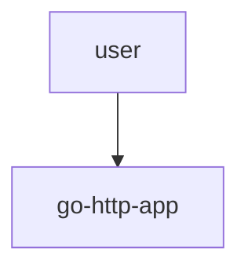
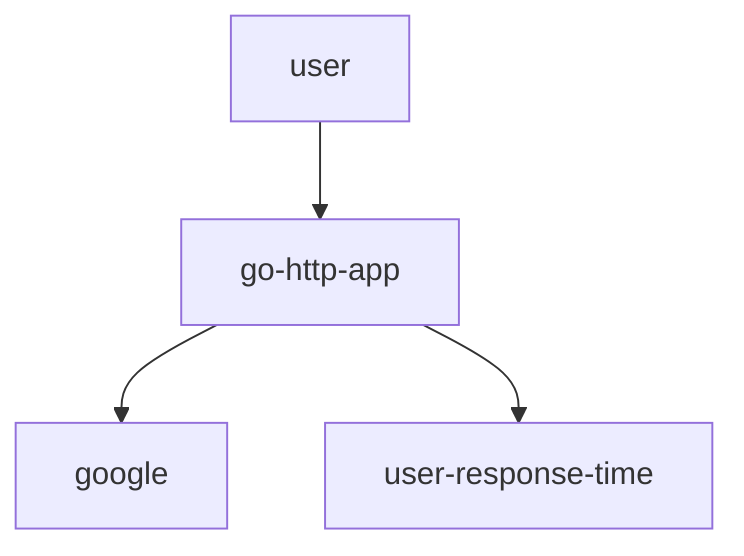
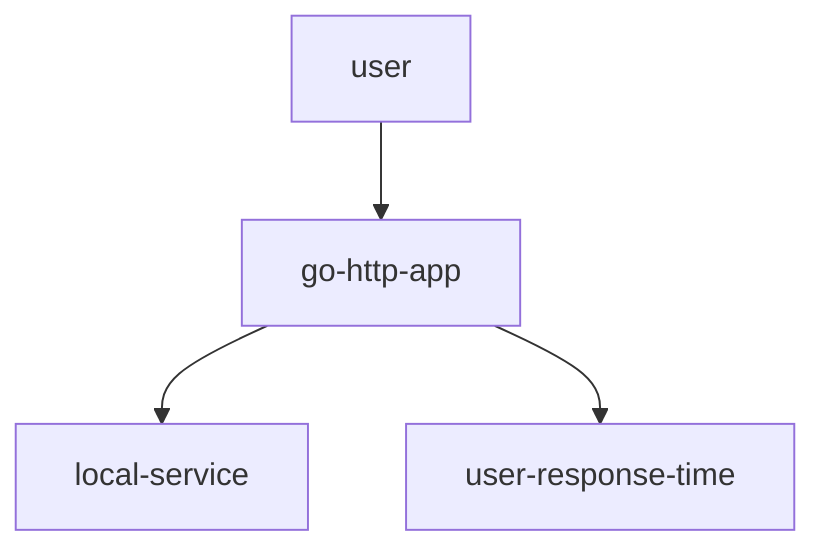
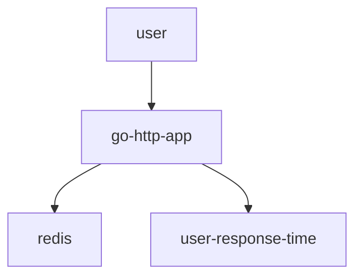

# http-go-based
http-go-based

first get you loadblancer endpoint 

elhayefrat@elhays% kubectl get svc 
NAME                        TYPE           CLUSTER-IP     EXTERNAL-IP    PORT(S)          AGE
from-github-http-go-based   LoadBalancer   10.0.206.27    xx.xx.xx.xx   8085:30232/TCP   40m

# first test that you can validate running app
this will return true if the app is up and running and will retun the latancy of the app 

elhayefrat@elhays% curl xx.xx.xx.xx:8085?validate=stamp'
Number to calculate, !REDIS, ! Start Calculating, %s!2023-01-03 08:06:53.809121733 +0000 UTC m=+2099.063091222from-github-http-go-based-5b9784c985-47phn%    

# second test that you can validate outside traffic app will try to get google.com
this will return true if the app is up and running and will retun the latancy of the app 

elhayefrat@elhays% curl xx.xx.xx.xx:8085?validate=google'
google, google!time outside, 123.654199ms!%  

# 3rd test that you can validate outside traffic app will try to get local service in k8s web based 
this will return true if the app is up and running and will retun the latancy of the app 

elhayefrat@elhays% curl xx.xx.xx.xx:8085?validate=true'
Validated, true!time inside, 3.513383ms!%    

# 3rd test that you can validate outside traffic app will try to get redis in cluster
this will return true if the app is up and running and will retun the latancy of the app 

elhayefrat@elhays% curl 'http://xx.xx.xx.xx:8085?redis=from-github-redis-0,&num=1'
Number to calculate, 1!REDIS, from-github-redis-0,!REDIS, from-github-redis-0,! Start Calculating, %s!2023-01-03 08:10:48.755705273 +0000 UTC m=+2334.040063203from-github-http-go-based-5b9784c985-hgqb4%     

redis is redis hostname you can route between 4 redis from-github-redis-0,1,2,3
num=1 is the number you want to calculate ( will increase cpu load)
